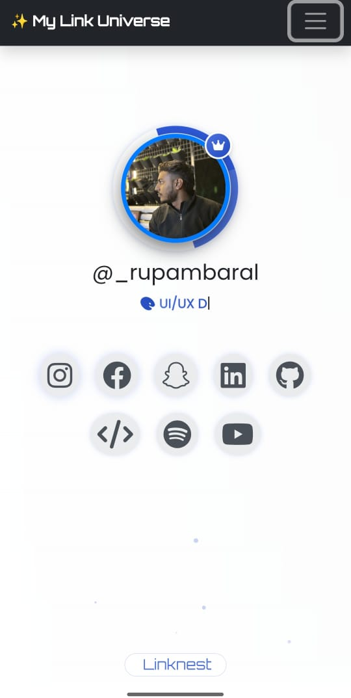
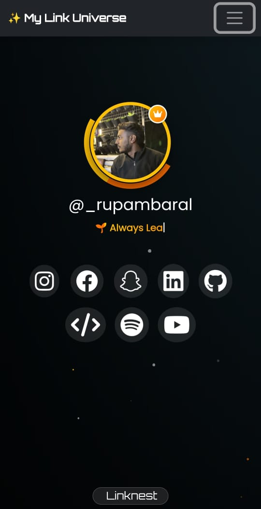

# 🌐 LinkNest

LinkNest is a beautifully crafted personal smart link hub — just like Linktree, but **fully customizable** and **self-hosted**. Made using **Bootstrap 5**, **AOS animations**, and responsive design principles to work across all devices.  

> 🔗 Showcase your links, portfolios, social profiles, projects, and more — all in one place.

---

## ✨ Features

- 🎨 Responsive UI with Light & Dark mode toggle
- 🧭 Smooth navbar with animated scrolling
- 🖼️ Animated profile display with hover effects
- 💬 Voice command system (browser-based)
- 📱 Mobile-first layout with collapsible nav
- 📷 Social icons & external links
- 🖼️ Popover or modal-based gallery/video previews
- 🔁 Share button with clipboard copy support
- 📦 Easy to deploy anywhere (GitHub Pages, Netlify, Vercel)

---

## 📸 Preview

---

